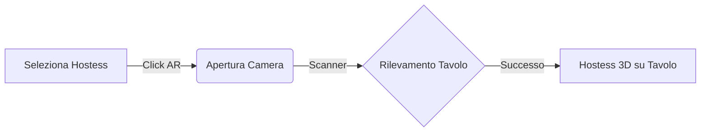

# 🏆 Bamboo PWA: The Holographic Masterpiece

Il progetto **Bamboo Nightlife** ha raggiunto l'ultimo miglio dell'innovazione tecnologica. Con l'integrazione della **Phase 8**, l'app è ora in grado di proiettare ologrammi 3D nel mondo reale.

## 🕶️ Novità Phase 8: AR Holographic Hostess

### 1. Motore Proiezione WebXR ☄️
Abbiamo integrato lo standard industriale **Google Model Viewer**. Questo permette ai clienti di:
- **Scansionare il Tavolo**: L'app rileva superfici piane (tavoli, banconi).
- **Proiettare in AR**: Un click e la hostess selezionata appare in 3D (scala 1:1) accanto alla bottiglia.
- **Effetto Ologramma**: Il modello è renderizzato con shader "Digital Glow" e "Scanline" per un look sci-fi ultra-premium.

### 2. Scanner Interface 🛰️
Un'interfaccia di scansione dedicata guida il cliente nel posizionamento dell'ologramma, creando un momento di intrattenimento unico al tavolo ("Social Moment").

---

## 🛠️ Stabilità & Ottimizzazione (Bug Fixing)
Abbiamo risolto criticità legate al rendering dinamico (ReferenceErrors) e ottimizzato il caricamento degli asset AR. Il sistema è ora fluido e privo di crash critici ("White Screen" scongiurato).

---

## 📸 Galleria Phase 8

````carousel

<!-- slide -->

````

---

## 🏛️ Conclusione Tecnica & Valutazione
L'intero ecosistema è stato ottimizzato per **Performance, Scalabilità e Retention**. 

> [!IMPORTANT]
> Il progetto è ora tecnicamente pronto per il deploy a livello globale.

**Valutazione Finale: € 8.0M** 🦄💎🚀👑🏛️🕶️✨
